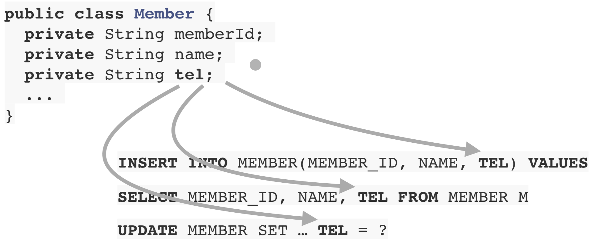

# JPA 소개

## SQL 중심적인 개발의 문제점

- CRUD시에 자바 객체를 SQL로, SQL을 자바 객체로 변환하는 작업을 반복적으로 계속 해야함
- 예를들어 객체에 필드 하나 추가하면 SQL문을 다 수정해야함
    
    
    
    → SQL에 의존적인 개발을 피하기 어렵다
    

### 패러다임의 불일치

- 객체를 영구 보관하는 저장소는 다양하지만 현실적으로 관계형 데이터베이스에 저장하는 경우가 많다
- 이 때 객체를 SQL을 통해 데이터베이스에 저장할 수 있도록 변환하는 작업이 필요하다

### 객체와 관계형 데이터베이스의 차이

- 상속
    
    
    
    - 저장시
        - 하나의 객체를 분해하고, 각각 INSERT문을 작성하여 저장해야한다
    - 조회시
        - 각각의 테이블에 따른 JOIN SQL을 작성한다.
        - 각각 객체를 생성해야한다
            
            → 매우 복잡
            
    - 그래서 DB에 저장할 객체에는 상속 관계를 안쓴다
- 연관관계
    - 객체는 참조를 사용한다
    - 테이블은 외래 키를 사용한다
        
        
        
    - 객체를 테이블에 맞추어 모델링
        
        ```java
        class Member {
        	String id;
        	Long teamId;
        	String username;
        }
        class Team {
        	Long id;
        	String name;
        }
        ```
        
    - 객체다운 모델링
        
        ```java
        class Member {
        	String id;
        	Team team;
        	String username;
        }
        class Team {
        	Long id;
        	String name;
        }
        ```
        
    - 객체 모델링을 조회할 때는 SQL을 실행하고 각각의 정보를 객체에 매핑하고 객체간의 관계를 설정하는 등 해야할 일이 많다.
- 객체 그래프 탐색
    - 객체는 자유롭게 객체 그래프를 탐색할 수 있어야 한다.
        
        
        
    - SQL문을 통해 탐색하는 경우 처음 실행하는 SQL에 따라 탐색 범위가 결정된다
        
        
        
    - 모든 객체를 미리 로딩할 수 없으므로 상황에 따라 동일한 회원 조회 메서드를 여러개 생성해야한다
    
    → 진정한 의미의 계층 분할이 어렵다
    

## JPA

- Java Persistence API
- 자바 진영의 ORM 기술의 표준

### ORM

- object-relational mapping(객체 관계 매핑)
- 객체는 객체대로, 관계형 데이터베이스는 관계형 데이터베이스대로 설계
- ORM 프레임워크가 중간에서 매핑
- 대중적인 언어에는 대부분 ORM 기술이 존재함

### JPA

- JPA는 애플리케이션과 JDBC 사이에서 동작한다
    
    
    
- JPA 동작 - 저장
    
    
    
- JPA 동작 - 조회
    
    
    
- JPA는 표준 명세
    - JPA는 인터페이스의 모음
    - JPA 2.1 표준 명세를 구현한 3가지 구현체
    - 하이버네이트, EclipseLink, DataNucleus

### 왜 JPA를 사용해야 하는가

- SQL 중심적인 개발에서 객체 중심으로 개발
- 생산성
    - 컬렉션에서 객체를 조회하듯이 메서드로 간단하게 조회 가능
- 유지보수
    - 기존에는 필드 변경시 모든 SQL을 수정해야했음
    - JPA 사용시에는 필드만 추가하면 됨, SQL은 JPA가 처리함
- 패러다임의 불일치 해결
    - 상속
        - 상속시 저장, 조회는 간단하게 메서드를 호출하여 할 수 있음
        - 나머지 SQL을 작성하는 것은 JPA가 처리함
    - JPA와 연관관계, 객체 그래프 탐색
        - 그래프 탐색시 필요한 부분을 JPA를 통해 SQL문을 만들어 가져올 수 있음
        - 자유로운 객체 그래프 탐색 가능함
        - 동일한 트랜잭션에서 조회한 엔티티는 같음을 보장
- 성능
    - 1차 캐시와 동일성 보장
        - 같은 트랜잭션 안에서는 같은 엔티티를 반환 - 약간의 조회 성능 향상
        - DB Isolation Level이 Read Commit이어도 애플리케이션에서 Repeatable Read 보장
    - 트랜잭션을 지원하는 쓰기 지연
        - 트랜잭션을 커밋할 때 까지 INSERT SQL을 모음
        - JDBC BATCH SQL 기능을 사용해서 한번에 SQL 전송
    - 지연 로딩과 즉시 로딩
        - 지연로딩 : 객체가 실제 사용될 때 로딩
        - 즉시 로딩 : JOIN SQL로 한번에 연관된 객체까지 미리 조회
- 데이터 접근 추상화와 벤더 독립성
- 표준

## Reference

- [김영한 자바 ORM 표준 JPA 프로그래밍 - 기본편](https://www.inflearn.com/course/ORM-JPA-Basic/dashboard)