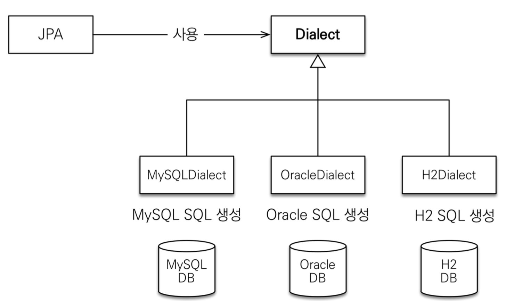

# JPA 시작

## JPA 시작

### persistence.xml

```xml
<?xml version="1.0" encoding="UTF-8"?>
 <persistence version="2.2"
	 xmlns="http://xmlns.jcp.org/xml/ns/persistence" xmlns:xsi="http://www.w3.org/2001/XMLSchema-instance"
	 xsi:schemaLocation="http://xmlns.jcp.org/xml/ns/persistence http://xmlns.jcp.org/xml/ns/persistence/persistence_2_2.xsd">
	 <persistence-unit name="hello">
		 <properties>
			 <!-- 필수 속성 -->
			 <property name="javax.persistence.jdbc.driver" value="org.h2.Driver"/>
			 <property name="javax.persistence.jdbc.user" value="sa"/>
			 <property name="javax.persistence.jdbc.password" value=""/>
			 <property name="javax.persistence.jdbc.url" value="jdbc:h2:tcp://localhost/~/test"/>
			 <property name="hibernate.dialect" value="org.hibernate.dialect.H2Dialect"/>
			 <!-- 옵션 -->
			 <property name="hibernate.show_sql" value="true"/>
			 <property name="hibernate.format_sql" value="true"/>
			 <property name="hibernate.use_sql_comments" value="true"/>
			 <!--<property name="hibernate.hbm2ddl.auto" value="create" />-->
		 </properties>
	 </persistence-unit>
 </persistence>
```

- JPA 설정 파일
- /META-INF/persistence.xml에 위치
- persistence-unit name으로 이름 지정
- javax.persistence로 시작 : JPA 표준 속성
- hibernate로 시작 : 하이버네이트 전용 속성

### 데이터베이스 방언



- JPA는 특정 데이터베이스에 종속되지 않음
- 각각의 데이터베이스가 제공하는 SQL 문법과 함수는 조금씩 다름
    - 가변 문자 : MySQL은 VARCHAR, Oracle은 VARCHAR2
    - 문자열을 자르는 함수 : SQL 표준은 SUBSTRING(), Oracle은 SUBSTR()
    - 페이징 : MySQL은 LIMIT, Oracle은 ROWNUM
- 방언 : SQL 표준을 지키지 않는 특정 데이터베이스만의 고유한 기능
- hibernate.dialect 속성에 지정

### JPA 동작


- 엔티티 매니저 팩토리는 하나만 생성해서 애플리케이션 전체에서 공유
- 엔티티 매니저는 쓰레드간 공유되지 않음 (사용하고 버려야 한다)
- JPA의 모든 데이터 변경은 트랜잭션 안에서 실행

### JPQL

- JPA를 사용하면 엔티티 객체를 중심으로 개발
- JPQL을 사용하여 검색할 때도 테이블이 아닌 엔티티 객체 대상으로 검색
- 모든 DB 데이터를 객체로 변환해서 검색하는 것은 불가능
- 애플리케이션이 필요한 데이터만 DB에서 불러오려면 결국 검색 조건이 포함된 SQL이 필요
- JPA는 SQL을 추상화한 JPQL이라는 객체 지향 쿼리 언어를 제공함
    - JPQL은 엔티티 객체를 대상으로 쿼리
    - SQL은 데이터베이스 테이블을 대상으로 쿼리
    - SQL을 추상화해서 특정 데이터베이스 SQL에 의존하지 않음