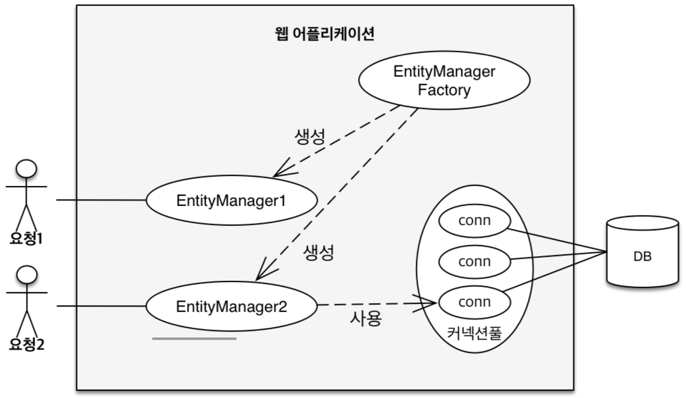

# 영속성 관리

## 엔티티 매니저 팩토리와 엔티티 매니저



## 영속성 컨텍스트

- 엔티티를 영구 저장하는 환경이라는 뜻
- EntityManager.persist(entity);
- 영속성 컨텍스트는 논리적인 개념으로 눈에 보이지 않는다
- 엔티티 매니저를 통해서 영속성 컨텍스트에 접근한다

### 엔티티의 생명주기


- 비영속 (new/transient)
    - 영속성 컨텍스트와 전혀 관계가 없는 새로운 상태
- 영속 (managed)
    - 영속성 컨텍스트에 관리되는 상태
    - em.persist(member)
- 준영속
    - 영속성 컨텍스트에 저장되었다가 분리된 상태
    - em.detach(member), em.remove(member)
- 삭제
    - 삭제된 상태

### 영속성 컨텍스트의 이점

- 1차 캐시
    - 엔티티 조회시
        
        
        
        - em.persist()를 통해 엔티티를 영속화함
    - 1차 캐시에서 조회
        
        
        
        - 영속상태인 엔티티를 find를 통해 조회하면 데이터베이스가 아닌 1차 캐시에서 조회한다.
    - 데이터베이스에서 조회
        
        
        
        - 1차 캐시에 없는 엔티티를 조회하는 경우 데이터베이스에서 조회하고 1차 캐시에 저장한다.
        - 이후 조회시에는 1차 캐시에서 조회한다.
    - 영속 엔티티의 동일성 보장
        - 1차 캐시를 통해 반복 가능한 읽기 등급의 트랜잭션 격리 수준을 어플리케이션 차원에서 제공함
- 쓰기 지연
    
    ```java
    EntityManager em = emf.createEntityManager();
    EntityTransaction tx = em.getTransaction();
    
    // 엔티티 매니저는 데이터 변경시 트랜잭션을 시작해야 한다
    tx.begin();
    
    em.persist(memberA);
    em.persist(memberB);
    // 아직 Insert 쿼리를 보내지 않는다.
    
    // 커밋하는 순간 데이터베이스에 Insert sql을 보낸다
    tx.commit();
    ```
    
    - memberA와 memberB를 persist
        
        
        
    - tx.commit()
        
        
        
- 변경 감지
    - 엔티티 수정
        
        
        
        - 1차 캐시는 처음에 영속화될 때의 값을 스냅샷으로 저장해놓음
        - 엔티티와 스냅샷을 비교하여 수정 사항이 발생하면 쓰기 지연 저장소에 UPDATE SQL을 생성하여 저장

### 플러시

- 영속성 컨텍스트의 변경 내용을 데이터베이스에 반영함
- 플러시 발생시
    - 변경감지
    - 수정된 엔티티를 쓰기 지연 SQL 저장소에 등록
    - 쓰기 지연 SQL 저장소의 쿼리를 데이터베이스에 전송
- 영속성 컨텍스트를 플러시 하는 방법
    - em.flush() - 직접 호출
    - 트랜잭션 커밋 - 플러시 자동 호출
    - JPQL 쿼리 실행 - 플러시 자동 호출
- JPQL 쿼리 실행시 플러시가 자동 호출되는 이유
    
    ```java
    em.persist(memberA);
    em.persist(memberB);
    em.persist(memberC);
    
    //중간에 JPQL 실행
    query = em.createQuery("select m from Member m", Member.class);
    ```
    
    - JPQL 쿼리 실행시 플러시가 호출되지 않으면 위와 같은 코드에서 memberA, memberB, memberC가 조회되지 않을 수 있음
- 플러시는 영속성 컨텍스트릴 비우지 않음
- 영속성 컨텍스트의 변경 내용을 데이터베이스에 동기화
- 트랜잭션이라는 작업 단위가 중요하다 → 커밋 직전에만 동기화 하면 된다

### 준영속

- 영속 → 준영속
- 영속 상태의 엔티티가 영속성 컨텍스트에서 분리(detached)
- 영속성 컨텍스트가 제공하는 기능을 사용하지 못합