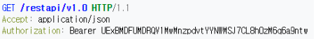
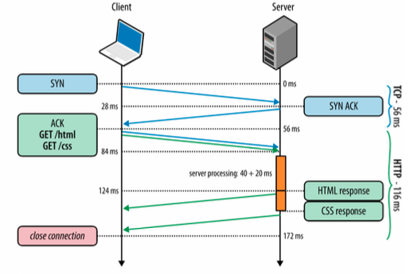
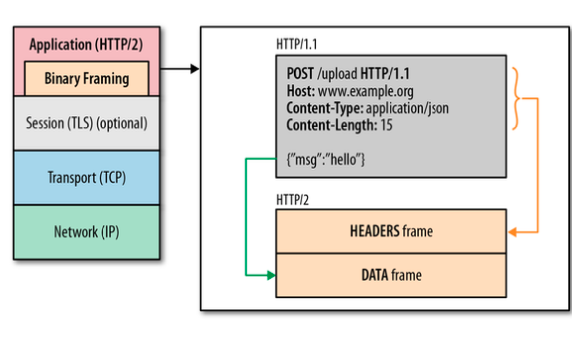
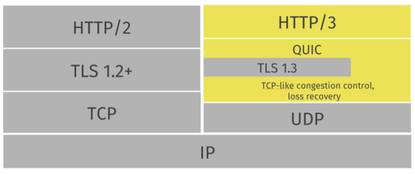

# HTTP

태그: 강의, 네트워크

## HTTP

- Hyper-text transfer Protocol
- Socket을 이용한 웹 페이지 전송 프로토콜 (HTTP/3에서는 UDP 사용)
- 웹 페이지 = 객체들의 집합
- 객체 = HTML file, JPEG image, audio/video file
- 웹 페이지 식별 → URL : universial resource locator
- 요청메시지
    
    
    
    - 요청 내용 : GET /restapi/v1.0 HTTP/1.1
    - 헤더
    - 빈 줄
    - 기타 메시지를 포함하여 표시된다
    - 요청 내용과 헤더 필드는 <CR> <LF>로 끝나야 함 (빈 줄이 <CR><LF>로 구성)
    - 클라이언트 → 서버에게 요청 메시지 보냄 (GET, POST, PUT, PATCH, DELETE 등등)
- 응답메시지
    - 서버 → 클라이언트에게 응답 메시지 보냄
        - HTTP/1.1 200 OK/r/n
        - Status line + Header lines + data
    - 상태표시 : 상태 코드와 reason message를 포함
    - 응답 헤더필드
    - 빈줄
    - 기타 메시지
- HTTP 응답과 요청이 이루어지는 과정
    1. 클라이언트와 서버가 TCP socket을 생성
    2. 클라이언트가 요청 메시지를 서버로 전송
    3. 서버가 응답메시지를 클라이언트에 전송
    4. 서버는 요청 객체를 클라이언트로 전송

## HTTP 프로토콜의 발전

- HTTP/1.0
    - HTTP 메소드에 대해서 1개의 TCP 연결을 사용
    - 객체 1개 전송에 1개의 TCP 연결 → 여러개의 TCP 연결이 1개 웹 페이지에 사용
    - TCP 연결 만들 때 왕복지연시간 문제 → non-persistent HTTP
- HTTP/1.1
    
    
    
    - HTTP 메소드 처리 이전 TCP 연결을 재사용
        - 왕복지연시간 감소 → persistent HTTP
    - pipelining으로 병렬 요청과 응답
- HTTP/2
    
    
    
    - 웹 페이지 성능 향상 목표
        - HTTP/1.1에서는 객체가 순차적으로 전송 (1개의 TCP 연결 내에서)
            - Head of Line 병목 발생 (처음에 전송된 객체의 용량이 크거나 시간이 오래 걸리는 경우)
        - 웹 페이지 로딩 시간을 50프로 단축하는 것이 목표
    - 바이너리 프레임
    - 서버 푸시
    - 스트림 전송
        - 멀티플렉싱, 우선순위 지원
    - 헤더 압축
- HTTP/3
    
    
    
    - TCP를 이용하는 HTTP/2의 HoL 병목현상을 해결하기 위해 사용
    - UDP 프로토콜 위에 구현
    - QUIC 프로토콜로 TCP의 기능 + TLS 기능 구현