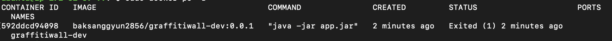
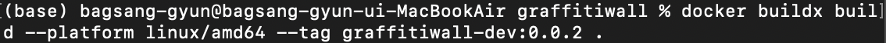

# 도커 멀티 플랫폼 빌드

지금까지 진행한 프로젝트를 프론트엔드와 연동하기 쉽도록 무료 클라우드 서버에 배포하려고 했었다.

개발한 코드를 빌드하고 도커 이미지로 만들어 도커 허브에 올리고, 클라우드 인스턴스에서 실행시켜 서버를 배포했다.

그런데 컨테이너를 실행시키면 계속 꺼지는 오류가 발생했다.

로그를 찍어보니 다음과 같이 나왔다

검색해보니, 내가 배포한 환경은 m1 맥이라서 해당 이미지가 arm64 기반으로 빌드된 것이 원인이었다.

docker buildx를 사용하여 amd64환경으로 다시 빌드해서 해결하였다.

해당 명령어를 사용하여 amd64 환경에서 돌아가도록 이미지를 다시 빌드했다