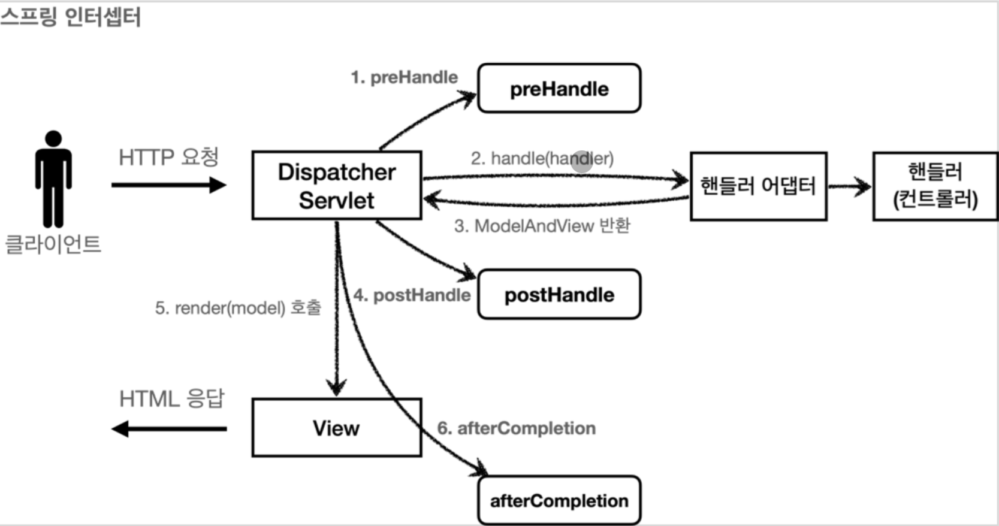

# 로그인 처리 (3) - 인터셉터

태그: 로그인, 스프링 MVC

## 스프링 인터셉터 - 소개

- 스프링 인터셉터도 서블릿 필터와 같이 웹과 관련된 공통 관심 사항을 효과적으로 해결할 수 있는 기술이다
- 서블릿 필터가 서블릿이 제공하는 기술이라면, 스프링 인터셉터는 스프링 MVC가 제공하는 기술이다
- 둘 다 웹과 관련된 공통 관심 사항을 처리하지만, 적용되는 순서와 범위, 사용방법이 다르다
- 스프링 인터셉터 흐름
    - HTTP 요청 → WAS → 필터 → 서블릿 → 스프링 인터셉터 → 컨트롤러
    - 스프링 인터셉터는 디스패처 서블릿과 컨트롤러 호출 직전에 호출된다
    - 스프링 인터셉터는 스프링 MVC가 제공하는 기능이기 때문에 디스패처 서블릿 이후에 등장하게 된다
        - 스프링 MVC의 시작점이 디스패처 서블릿
    - 스프링 인터셉터에도 URL 패턴을 적용할 수 있는데, 서블릿 URL 패턴과는 다르고, 매우 정밀하게 설정할 수 있다
- 스프링 인터셉터 제한
    - HTTP 요청 → WAS → 필터 → 서블릿 → 스프링 인터셉터 →  컨트롤러 // 로그인 사용자
    - HTTP 요청 → WAS → 필터 → 서블릿 → 스프링 인터셉터  // 비 로그인 사용자 (적절하지 않은 요청이라 판단되면 컨트롤러를 호출하지 않음)
- 스프링 인터셉터 체인
    - HTTP 요청 → WAS → 필터 → 서블릿 → 인터셉터 1 → 인터셉터 2 →  컨트롤러
    - 스프링 인터셉터는 체인으로 구성되는데, 중간에 인터셉터를 자유롭게 추가할 수 있다.
- 스프링 인터셉터 인터페이스
    
    ```java
    public interface HandlerInterceptor {
    	default boolean preHandle(HttpServletRequest request, HttpServletResponse response, 
    	  Object handler) throws Exception {}
    	default void postHandle(HttpServletRequest request, HttpServletResponse response, 
    	  Object handler, @Nullable ModelAndView modelAndView) throws Exception {}
      default void afterCompletion(HttpServletRequest request, HttpServletResponse response,
        Object handler, @Nullable Exception ex) throws Exception {}
    }
    ```
    
    - 서블릿 필터의 경우 단순하게 doFilter() 하나만 제공한다
    - 인터셉터는 호출 전(preHandle), 호출 후(postHandle), 요청 완료 이후(afterCompletion)과 같이 단계적으로 잘 세분화 되어있다
    - 서블릿 필터의 경우 단순히 request, response만 제공했지만, 인터셉터는 어떤 컨트롤러(handler)가 호출되는지 호출 정보도 받을 수 있다
    - 어떤 modelAndView가 반환되는지 응답 정보도 받을 수 있다.
- 스프링 인터셉터 호출 흐름
    
    
    
    - 정상 흐름
        - preHandle : 컨트롤러 호출 전에 호출된다
            - preHandle의 응답값이 true이면 다음으로 진행하고, false면 더 진행하지 않는다
        - postHandle : 컨트롤러 호출 후에 호출된다
        - afterCompletion : 뷰가 렌더링 된 이후에 호출된다
- 스프링 인터셉터 예외
    
    
    
    - 예외 발생시
        - preHandle : 컨트롤러 호출 전에 호출된다
        - postHandle : 컨트롤러에서 예외가 발생하면 postHandle은 호출되지 않는다
        - afterCompletion : afterCompletion은 항상 호출된다. 이 경우 예외를 파라미터로 받아서 어떤 예외가 발생했는지 로그로 출력할 수 있다
    - afterCompletion은 예외가 발생해도 호출된다
        - 예외가 발생하면 postHandle()는 호출되지 않으므로 예외와 무관하게 공통 처리를 하려면 afterCompletion()을 사용해야 한다
        - 예외가 발생하면 afterCompletion에 예외 정보를 포함해서 호출된다.

## 스프링 인터셉터 - 요청 로그

### 요청 로그 인터셉터

```java
@Slf4j
public class LogInterceptor implements HandlerInterceptor {
  public static final String LOG_ID = "logId";

  @Override
  public boolean preHandle(HttpServletRequest request, HttpServletResponse response, Object handler) throws Exception {
    String requestURI = request.getRequestURI();
    String uuid = UUID.randomUUID().toString();
    request.setAttribute(LOG_ID, uuid);
    //@RequestMapping: HandlerMethod
    //정적 리소스: ResourceHttpRequestHandler 
    if (handler instanceof HandlerMethod) {
      HandlerMethod hm = (HandlerMethod) handler; //호출할 컨트롤러 메서드의 모든 정보가 포함되어 있다.
    }
    log.info("REQUEST  [{}][{}][{}]", uuid, requestURI, handler);
    return true; //false 진행X 
  }

	@Override
	public void postHandle(HttpServletRequest request, HttpServletResponse response, Object handler, ModelAndView modelAndView) throws Exception {
	  log.info("REQUEST  [{}][{}][{}]", uuid, requestURI, handler);
	  return true; //false 진행X 
  }

  @Override
  public void afterCompletion(HttpServletRequest request, HttpServletResponse response, Object handler, Exception ex) throws Exception {
    String requestURI = request.getRequestURI();
    String logId = (String)request.getAttribute(LOG_ID);
    log.info("RESPONSE [{}][{}]", logId, requestURI);
    if (ex != null) {
      log.error("afterCompletion error!!", ex);
    }
  } 
}
```

- request.setAttribute(LOG_ID, uuid)
    - 서블릿 필터의 경우 지역변수로 해결이 가능하지만, 스프링 인터셉터는 호출이 완전히 분리되어있다
    - 따라서 preHandle에서 지정한 값을 postHandle, afterCompletion에서 사용하려면 어딘가에 담아두어야 한다.
- HandlerMethod
    - 핸들러 정보는 어떤 핸들러 매핑을 사용하는가에 따라 달라진다.
    - @Controller, @RequestMapping을 활용한 핸들러 매핑을 사용할 경우 HandlerMethod가 넘어온다
- ResuorceHttpRequestHandler
    - 정적 리소스가 호출되는 경우 해당 핸들러가 핸들러 정보로 넘어오기 때문에 타입에 따라 처리가 필요하다
- postHandle, afterCompletion
    - 종료 로그를 afterCompletion에서 실행한 이유는 예외가 발생한 경우 postHandle가 호출되지 않기 때문이다.
    - afterCompletion은 예외가 발생해도 호출 되는 것을 보장한다.

### WebConfig - 인터셉터 등록

```java
@Configuration
public class WebConfig implements WebMvcConfigurer {
  @Override
  public void addInterceptors(InterceptorRegistry registry) {
    registry.addInterceptor(new LogInterceptor())
            .order(1)
  }
}
```

- WebMvcConfigurer가 제공하는 addInterceptors를 사용해서 인터셉터를 등록할 수 있다
- registry.addInterceptor() : 인터셉터를 등록한다
- order(1) : 인터셉터의 호출 순서를 지정한다. 낮을수록 먼저 호출된다
- addPathPatterns(”/**”) : 인터셉터를 적용할 URL 패턴을 지정한다
- excludePathPatterns(”/css/**”, “/*.ico”, “/error”) : 인터셉터에서 제외할 패턴을 지정한다

## 스프링 인터셉터 - 인증 체크

### 로그인 체크 인터셉터

```java
@Slf4j
public class LoginCheckInterceptor implements HandlerInterceptor {
  @Override
  public boolean preHandle(HttpServletRequest request, HttpServletResponse response, Object handler) throws Exception {
    String requestURI = request.getRequestURI(); 
    log.info("인증 체크 인터셉터 실행 {}", requestURI);
    HttpSession session = request.getSession(false);
    if (session == null || session.getAttribute(SessionConst.LOGIN_MEMBER) == null) {
      log.info("미인증 사용자 요청");
      //로그인으로 redirect 
      response.sendRedirect("/login?redirectURL=" + requestURI); 
      return false;
    }
  return true;
  }
}
```

- 서블릿 필터와 비교해서 코드가 매우 간결하다
- 인증은 컨트롤러 호출 전에만 호출되면 된다. 따라서 preHandle만 구현하면 된다.

### 세밀한 설정

```java
@Configuration
public class WebConfig implements WebMvcConfigurer {
  @Override
  public void addInterceptors(InterceptorRegistry registry) {
    registry.addInterceptor(new LogInterceptor())
            .order(1)
            .addPathPatterns("/**")
            .excludePathPatterns("/css/**", "/*.ico", "/error");
    registry.addInterceptor(new LoginCheckInterceptor())
            .order(2)
            .addPathPatterns("/**")
            .excludePathPatterns(
              "/", "/members/add", "/login", "/logout",
              "/css/**", "/*.ico", "/error"
    );
  }
}
```

- 인터셉터를 적용하거나 하지 않을 부분은 addPathPatterns와 excludePathPatterns에 작성하면 된다