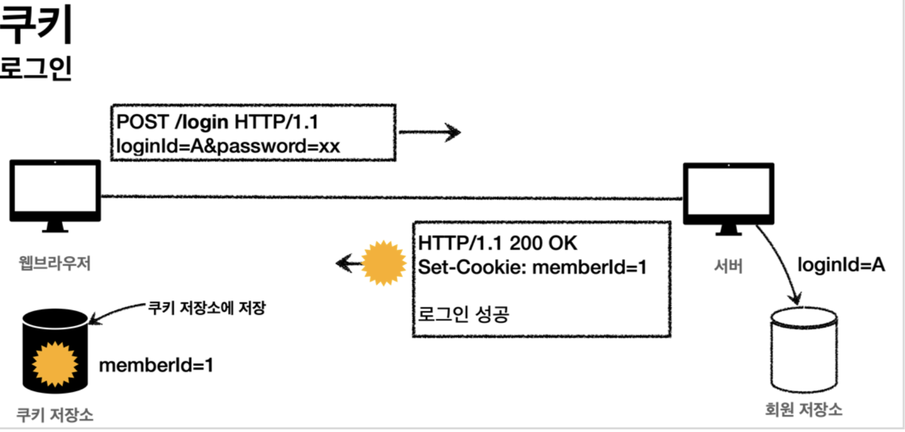

# 로그인 처리 (1)

태그: 로그인, 스프링 MVC

## 로그인 처리하기 - 쿠키 사용

- 로그인 상태 유지하기
    - 로그인시 쿼리 파라미터를 유지하면서 계속 보내는 것은 매우 어렵고 번거롭다
    - 서버에서 로그인에 성공하면 HTTP응답에 쿠키를 담아서 브라우저에 전달하자
        - 그러면 브라우저는 앞으로 해당 쿠키를 지속해서 보내준다

### 쿠키 생성

- 쿠키 생성
    
    
    
- 클라이언트 쿠키 전달
    
    
    
- 클라이언트 쿠키 전달 2
    
    
    
- 쿠키에는 영속 쿠키와 세션 쿠키가 있다
    - 영속 쿠키 : 만료 날짜를 입력하면 해당 날짜까지 유지
    - 세션 쿠키 : 만료 날짜를 생략하면 브라우저 종료시 까지만 유지

### 로그인 기능

- 쿠키를 사용한 로그인 코드
    
    ```java
    @PostMapping("/login")
    public String login(@Valid @ModelAttribute LoginForm form, BindingResult bindingResult, HttpServletResponse response) {
    	if (bindingResult.hasErrors()) {
    	  return "login/loginForm";
    	}
    	Member loginMember = loginService.login(form.getLoginId(), form.getPassword());
      log.info("login? {}", loginMember);
      if (loginMember == null) {
    		bindingResult.reject("loginFail", "아이디 또는 비밀번호가 맞지 않습니다.");
        return "login/loginForm";
      }
    //로그인 성공 처리
    //쿠키에 시간 정보를 주지 않으면 세션 쿠키(브라우저 종료시 모두 종료)
      Cookie idCookie = new Cookie("memberId", String.valueOf(loginMember.getId()));
      response.addCookie(idCookie);
      return "redirect:/";
    }
    ```
    
- 쿠키 생성 로직
    
    ```java
    Cookie idCookie = new Cookie("memberId", String.valueOf(loginMember.getId()));
      response.addCookie(idCookie);
    ```
    
    - 로그인에 성공하면 쿠키를 생성하고 HttpServletResponse에 담는다
    - 쿠키의 이름은 memberId이고 값은 회원의 id를 담아둔다
    - 종료 전 까지 회원의 id를 서버에 계속 보내준다
- 로그인 사용자 전용 홈 화면
    
    ```java
    @GetMapping("/")
    public String homeLogin(
           @CookieValue(name = "memberId", required = false) Long memberId, Model model) {
      if (memberId == null) {
        return "home";
      }
      //로그인
      Member loginMember = memberRepository.findById(memberId);
      if (loginMember == null) {
        return "home";
      }
      model.addAttribute("member", loginMember);
      return "loginHome";
    }
    ```
    
    - @CookieValue를 사용하여 편하게 쿠키를 조회할 수 있다
    - 로그인 하지 않는 사용자도 홈 화면에 접근할 수 있으므로 required=false를 사용한다
    - 로직 분석
        - 로그인 쿠키 (memberId)가 없는 사용자는 기존 home으로 보낸다
        - 로그인 쿠키가 있어도 회원이 없으면 home으로 보낸다
        - 로그인 쿠키 (memberId)가 있는 사용자는 로그인 전용 홈 화면인 loginHome으로 보낸다

### 로그아웃 기능

- 로그아웃 방법은 다음과 같다
    - 세션 쿠키이므로 웹 브라우저 종료시
    - 서버에서 해당 쿠키의 종료 날짜를 0으로 지정
- 로그아웃 코드
    
    ```java
    @PostMapping("/logout")
    public String logout(HttpServletResponse response) {
      expireCookie(response, "memberId");
      return "redirect:/";
    }
    private void expireCookie(HttpServletResponse response, String cookieName) {
      Cookie cookie = new Cookie(cookieName, null);
      cookie.setMaxAge(0);
      response.addCookie(cookie);
    }
    ```
    
    - Max-Age=0으로 설정되어서 해당 쿠키는 즉시 종료된다

### 쿠키와 보안 문제

- 쿠키만 사용한 로그인에는 심각한 보안 문제가 있다
- 보안문제
    - 쿠키의 값은 임의로 변경할 수 있다
        - 클라이언트가 쿠키를 강제로 변경하면 다른 사용자가 된다
    - 쿠키에 보관된 정보는 훔쳐갈 수 있다
        - 쿠키는 웹 브라우저에도 보관되고, 네트워크 요청마다 계속 클라이언트에서 서버로 전달한다
        - 쿠키의 정보가 나의 PC나 네트워크 전송 구간에서 탈취될 수 있다
    - 해커가 한번 훔쳐가면 평생 사용할 수 있다
        - 해커카 쿠키를 훔쳐가서 악의적인 요청을 계속 시도할 수 있다
- 대안
    - 쿠키에 중요한 값을 노출하지 않고, 사용자 별로 예측 불가능한 임의의 토큰을 노출해서 서버에서 토큰과 사용자 id를 매핑해서 인식한다.
    - 토큰은 해커가 임의의 값을 넣어도 찾을 수 없도록 예상 불가능 해야한다
    - 해커다 토큰을 가져가도 시간이 지나면 사용할 수 없도록 해당 토큰의 만료시간을 짧게 유지한다
    - 해킹이 의심되는 경우 서버에서 해당 토큰을 강제로 제거한다

## 로그인 처리하기 - 세션 동작 방식

- 쿠키에 중요한 정보를 보관하는 방식은 여러 보안 이슈가 있다
- 이 문제를 해결하기 위해서는 중요한 정보를 모두 서버에 저장해야 한다
- 클라이언트와 서버는 추정 불가능한 임의의 식별자 값으로 연결해야한다
- 이렇게 서버에 중요한 정보를 보관하고 연결을 유지하는 방법을 세션이라 한다

### 세션 동작 방식

- 로그인
    
    
    
    - 사용자가 loginId, password 정보를 전달하면 서버에서 해당 사용자가 맞는지 확인한다
- 세션 생성
    
    
    
    - 세션 ID를 생성하는데, 추정 불가능해야 한다
        - UUID는 추정 불가능하다
    - 생성된 세션 ID와 세션에 보관할 값(memberA)를 서버의 세션 저장소에 보관한다
- 세션 id를 응답 쿠키로 전달
    
    
    
    - 클라이언트와 서버는 결국 쿠키로 연결되어야 한다
        - 서버는 클라이언트에 mySessionId라는 이름으로 세션 id만 쿠키에 담아서 전달한다
        - 클라이언트는 쿠키 저장소에 mySessionId 쿠키를 보관한다
    - 중요
        - 회원과 관련된 정보는 전혀 클라이언트에 전달하지 않는다
        - 오직 추정 불가능한 세션 ID만 쿠키를 통해 클라이언트에 전달한다
- 클라이언트의 세션id 쿠키 전달
    
    
    
    - 클라이언트는 요청시 항상 mySessionId 쿠키를 전달한다
    - 서버에서는 클라이언트가 전달한 mySessionId 쿠키 정보로 세션 저장소를 조회해서 로그인시 보관한 세션 정보를 사용한다

## 로그인 처리하기 -  서블릿 HTTP 세션 1

- 세션 관리는 크게 다음 세가지 기능을 제공하면 된다
    - 세션 생성
        - sessionId 생성 (임의의 추정 불가능한 랜덤값)
        - 세션 저장소에 sessionId와 보관할 값 저장
        - sessionId로 응답 쿠키를 생성해서 클라이언트에 전달
    - 세션 조회
        - 클라이언트가 요청한 sessionId 쿠키의 값으로, 세션 저장소에 보관한 값 조회
    - 세션 만료
        - 클라이언트가 요청한 sessionId 쿠키의 값으로, 세션 저장소에 보관한 sessionId와 값 제거
- 서블릿은 세션을 위해 HttpSession이라는 기능을 제공한다
    - HttpSession을 사용하면 다음과 같은 쿠키를 생성한다
        - Cookie: JSESSIONID=5B78E23B513F50164D6FDD8C97B0AD05
        - 이 값은 추정 불가능한 랜덤 값이다

### HttpSession 사용

- 세션을 사용한 로그인 코드
    
    ```java
    @PostMapping("/login")
    public String loginV3(@Valid @ModelAttribute LoginForm form, BindingResult bindingResult, HttpServletRequest request) {
      if (bindingResult.hasErrors()) {
        return "login/loginForm";
      }
      Member loginMember = loginService.login(form.getLoginId(), form.getPassword());
      log.info("login? {}", loginMember);
      if (loginMember == null) {
        bindingResult.reject("loginFail", "아이디 또는 비밀번호가 맞지 않습니다.");
        return "login/loginForm";
      }
      //로그인 성공 처리
      //세션이 있으면 있는 세션 반환, 없으면 신규 세션 생성
      HttpSession session = request.getSession(); //세션에 로그인 회원 정보 보관
      session.setAttribute(SessionConst.LOGIN_MEMBER, loginMember);
      return "redirect:/";
    }
    ```
    
    - 세션 생성과 조회
        - 세션을 생성하려면 request.getSession(true)를 사용하면 된다
        - 세션의 create 옵션
            - request.getSession(true)
                - 세션이 있으면 기존 세션을 반환한다
                - 세션이 없으면 새로운 세션을 생성해서 반환한다
            - request.getSession(false)
                - 세션이 있으면 기존 세션을 반환한다
                - 세션이 없으면 새로운 세션을 생성하지 않는다. null을 반환한다
        - 세션에 로그인 회원 정보 보관
            - session.setAttribute(SessionConst.LOGIN_MEMBER, loginMember)
            - 세션에 데이터를 보관하는 방법이다.
            - 하나의 세션에 여러 값을 저장할 수 있다.
- 로그아웃 코드
    
    ```java
    @PostMapping("/logout")
    public String logoutV3(HttpServletRequest request) {
      //세션을 삭제한다.
      HttpSession session = request.getSession(false); 
      if (session != null) {
        session.invalidate();
      }
      return "redirect:/";
    }
    ```
    
    - session.invalidate() : 세션을 제거한다
- 로그인 홈화면
    
    ```java
    @GetMapping("/")
    public String homeLoginV3(HttpServletRequest request, Model model) {
      //세션이 없으면 home
      HttpSession session = request.getSession(false);
      if (session == null) {
        return "home";
      }
      Member loginMember = (Member) session.getAttribute(SessionConst.LOGIN_MEMBER);
      //세션에 회원 데이터가 없으면 home 
      if (loginMember == null) {
        return "home";
      }
      //세션이 유지되면 로그인으로 이동 
      model.addAttribute("member", loginMember); 
      return "loginHome";
    }
    ```
    
    - request.getSession(false) : 세션을 찾아서 사용하는 시점에는 create: false 옵션을 사용해서 세션이 생성되지 않아야한다.
    - session.getAttribute(SessionConst.LOGIN_MEMBER) : 로그인 시점에 세션에 보관한 회원 객체를 찾는다.

## 로그인 처리하기 - 서블릿 HTTP 세션 2

- @SessionAttribute
    - 스프링은 세션을 더 편리하게 사용할 수 있도록 @SessionAttribute를 지원한다
    - 이미 로그인 된 사용자를 찾을 때 다음과 같이 사용하면 된다
        - @SessionAttribute(name = “loginMember”, required = false) Member loginMember
    - 이 기능은 세션을 생성하지 않는다
- 로그인 홈화면
    
    ```java
    @GetMapping("/")
    public String homeLoginV3Spring(
      @SessionAttribute(name = SessionConst.LOGIN_MEMBER, required = false)
      Member loginMember,
      Model model) {
      //세션에 회원 데이터가 없으면 home 
      if (loginMember == null) {
        return "home";
      }
    //세션이 유지되면 로그인으로 이동 
      model.addAttribute("member", loginMember); 
      return "loginHome";
    }
    ```
    
    - 세션을 찾고 세션에 들어있는 데이터를 찾는 과정을 스프링이 한번에 처리해준다
- TrackingModes
    - 로그인을 처음 시도하면 URL이 다음과 같이 jsessionid를 포함하고 있는 것을 확인할 수 있다
        - http://localhost:8080/;jsessionid=F59911518B921DF62D09F0DF8F83F872
        - 웹 브라우저가 쿠키를 지원하지 않을 때 쿠키 대신 URL을 통해 세션을 유지하는 방법이다
    - URL 전달 방식을 끄고 항상 쿠키를 통해서만 세션을 유지하려면 다음 옵션을 넣어주면 된다.
        - application.properties
            - server.servlet.session.tracking-modes=cookie

### 세션 정보

- 세션 정보 확인
    - sessionId : 세션 id, JSESSIONID의 값이다
    - maxInactiveInterval : 세션의 유효 시간
    - createTime : 세션 생성일시
    - lastAccessedTime : 세션과 연결된 사용자가 최근에 서버에 접속한 시간, 클라이언트에서 서버로 sessionId를 요청한 경우 갱신된다
    - isNew : 새로 생성된 세션인지 여부

### 세션 타임아웃 설정

- 세션을 무한정 보관하면 다음과 같은 문제가 발생할 수 있다.
    - 세션과 관련된 쿠키를 탈취당했을 경우 오랜 시간이 지나도 해당 쿠키로 악의적인 요청을 할 수 있다
    - 세션은 기본적으로 메모리에 생성된다. 10만명의 사용자가 로그인하면 10만개의 세션이 생성된다
- 세션의 종료 시점
    - 세션 생성 시점부터 30분으로 정하면 이용중에 계속 다시 로그인해서 세션을 생성해야한다
    - 사용자가 서버에 최근 요청한 시간을 기준으로 30분을 유지해주는 방법이 있다 (HttpSession)
- 세션 타임아웃 발생
    - LastAccessedTime 이후 timeout 시간이 지나면 WAS가 내부에서 해당 세션을 제거한다.