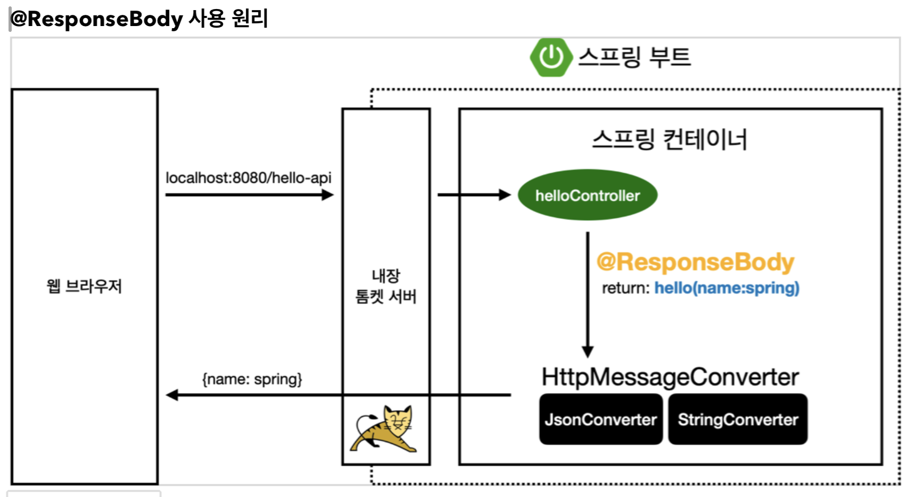

# 메시지 컨버터, 요청 매핑 핸들러 어댑터 구조

태그: 스프링 MVC

## HTTP 메시지 컨버터

- 뷰 템플릿으로 HTML을 생성해서 응답하는 것이 아니라, HTTP API 처럼 JSON 데이터를 HTTP 메시지 바디에 직접 읽거나 쓰는 경우 HTTP 메시지 컨버터를 사용하면 편리하다.
- **@ResponseBody 사용 원리**
    
    
    
    - HTTP의 Body에 문자 내용을 직접 반환
    - ViewResolver 대신에 HttpMessageConverter가 동작
    - 기본 문자처리 : StringHttpMessageConverter
    - 기본 객체처리 : MappingJackson2HttpMessageConverter
    - byte 처리 등등 기타 여러 HttpMessageConverter가 기본으로 등록되어 있음
- 스프링 MVC는 다음의 경우에 HTTP 메시지 컨버터를 적용한다
    - HTTP 요청 : @RequestBody, HttpEntity(RequestEntity)
    - HTTP 응답 : @ResponseBody, HttpEntity(ResponseEntity)
- HTTP 메시지 컨버터 인터페이스
    
    ```java
    package org.springframework.http.converter;
      public interface HttpMessageConverter<T> {
        boolean canRead(Class<?> clazz, @Nullable MediaType mediaType);
        boolean canWrite(Class<?> clazz, @Nullable MediaType mediaType);
        List<MediaType> getSupportedMediaTypes();
        T read(Class<? extends T> clazz, HttpInputMessage inputMessage)
                throws IOException, HttpMessageNotReadableException;
        void write(T t, @Nullable MediaType contentType, HttpOutputMessageoutputMessage)
                throws IOException, HttpMessageNotWritableException;
    }
    ```
    
    - HTTP 메시지 컨버터는 요청, 응답 둘 다 사용된다
    - canRead(), canWrite() : 메시지 컨버터가 해당 클래스, 미디어타입을 지원하는지 체크
    - read(), write() : 메시지 컨버터를 통해서 메시지를 읽고 쓰는 기능
- 스프링 부트 기본 메시지 컨버터
    - 스프링 부트는 다양한 메시지 컨버터를 제공하는데, 대상 클래스 타입과 미디어 타입 둘을 체크해서 사용 여부를 결정한다.
    - 만족하지 않으면 다음 메시지 컨버터로 우선순위가 넘어간다
    - ByteArrayHttpMessageConverter : byte[] 데이터를 처리한다
        - 클래스 타입: byte[], 미디어 타입: *
        - 요청 예) @RequestBody byte[] data
        - 응답 예) @ResponseBody return byte[]
        - 쓰기 미디어타입: application/octet-stream
    - StringHttpMessageConverter: String 문자로 데이터를 처리한다
        - 클래스 타입: String, 미디어타입: *
        - 요청 예) @RequestBody String data
        - 응답 예) @ResponseBody return “ok”
        - 쓰기 미디어타입: text/plain
    - MappingJackson2HttpMessageConverter: application/json
        - 클래스 타입: 객체 또는 HashMap, 미디어타입: application/json 관련
        - 요청 예) @RequestBody HelloData data
        - 응답 예) @ResponseBody return helloData
        - 쓰기 미디어타입: application/json 관련
- HTTP 요청 데이터 읽기
    - HTTP 요청이 오고, 컨트롤러에서 @RequestBody, HttpEntity 파라미터를 사용한다
    - 메시지 컨버터가 메시지를 읽을 수 있는지 확인하기 위해 canRead()를 호출한다
        - 대상 클래스 타입을 지원하는가?
        - HTTP 요청의 Content-Type 미디어 타입을 지원하는가
    - canRead() 조건을 만족하면 read()를 호출해서 객체를 생성하고 반환한다
- HTTP 응답 데이터 생성
    - 컨트롤러에서 @ResponseBody, HttpEntity로 값이 반환된다
    - 메시지 컨버터가 메시지를 쓸 수 있는지 확인하기 위해 canWrite()를 호출한다
        - 대상 클래스 타입을 지원하는가?
        - HTTP 요청의 Accept 미디어 타입을 지원하는가
    - canWrite() 조건을 만족하면 write()를 호출해서 HTTP 응답 메시지 바디에 데이터를 생성한다

## 요청 매핑 핸들러 어댑터 구조

- HTTP 메시지 컨버터는 @RequestMapping을 처리하는 핸들러 어댑터인 RequestMappingHandlerAdapter에서 호출된다
- RequestMappingHandlerAdapter 동작 방식
    
    
    
    - **ArgumentResolver**
        - 애노테이션 기반의 컨트롤러가 파라미터를 유연하게 처리할 수 있는 이유가 바로 ArgumentResolver 덕분이다.
        - RequestMappingHandlerAdapter는 ArgumentResolver를 호출해서 컨트롤러가 필요로 하는 다양한 파라미터의 값을 생성한다
        - 그리고 파라미터의 값이 모두 준비되면 컨트롤러를 호출해서 값을 넘겨준다
        - 동작 방식
            - ArgumentResolver의 supportsParameter()를 호출해서 해당 파라미터를 지원하는지 체크하고, 지원하면 resolveArguement()를 호출해서 실제 객체를 생성한다
            - 이렇게 생성된 객체가 컨트롤러 호출시 넘어간다
    - **ReturnValueHandler**
        - HandlerMethodReturnValueHandler를 줄여서 ReturnValueHandler라 부른다
        - 응답 값을 변환하고 처리한다
        - 컨트롤러에서 String으로 뷰 이름을 반환해도 동작하는 이유가 바로 ReturnValueHandler 덕분이다
    - **HTTP 메시지 컨버터 위치**
        
        
        
        - 요청의 경우
            - @RequestBody를 처리하는 ArgumentResolver가 있고, HttpEntity를 처리하는 ArguementResolver가 있다. 이 ArgumentResolver들이 HTTP 메시지 컨버터를 사용해서 필요한 객체를 생성한다
        - 응답의 경우
            - @ResponseBody와 HttpEntity를 처리하는 ReturnValueHandler가 있다. 여기에서 HTTP 메시지 컨버터를 호출해서 응답 결과를 만든다
    - 확장
        - 스프링은 ArgumentResolver, ReturnValueHandler, HttpMessageConverter 모두 인터페이스로 제공한다
        - 따라서 필요하면 언제든지 기능을 확장할 수 있다
        - 기능 확장은 WebMvcConfigurer를 상속 받아서 스프링 빈으로 등록하면 된다