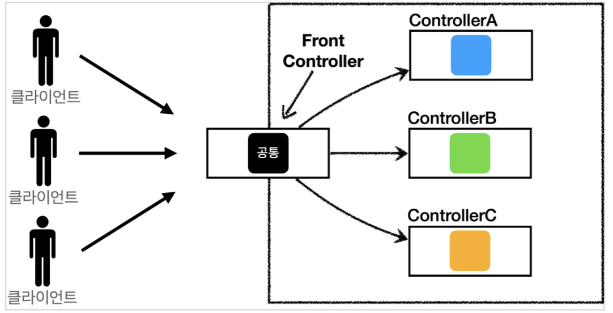
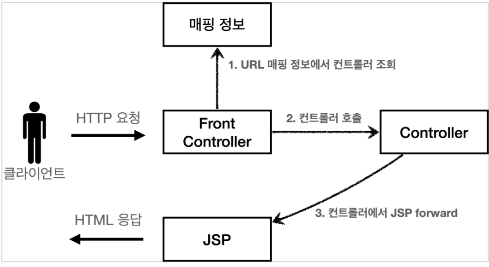
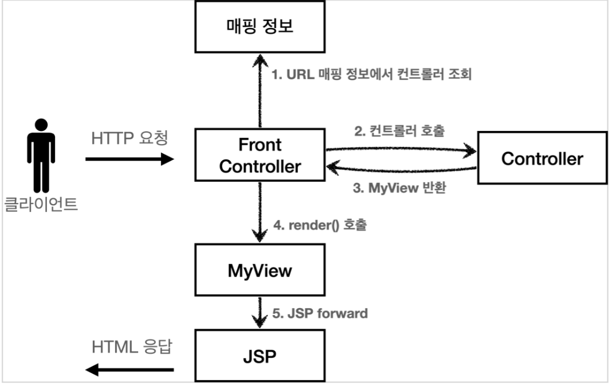

# 프론트 컨트롤러 패턴(1)

태그: 스프링 MVC

## 프론트 컨트롤러 패턴



- **프론트 컨트롤러 패턴 특징**
    - 프론트 컨트롤러 서블릿 하나로 클라이언트의 요청을 받음
    - 프론트 컨트롤러가 요청에 맞는 컨트롤러를 찾아서 호출
    - 공통 처리 가능
    - 프론트 컨트롤러를 제외한 나머지 컨트롤러는 서블릿을 사용하지 않아도 됨
- **프론트 컨트롤러 도입 - V1**
    - 기존의 코드를 순차적으로 프론트 컨트롤러로 리팩토링한다
    
    
    
    - **컨트롤러 인터페이스**
        
        ```java
        public interface ControllerV1 {
        	void process(HttpServletRequest request, HttpServletResponse response) throws ServletException, IOException;
        }
        ```
        
        - 서블릿과 비슷한 모양의 컨트롤러 인터페이스를 도입한다
            - 각 컨트롤러는 이 인터페이스를 구현하면 된다.
        - 프론트 컨트롤러는 이 인터페이스를 호출하여 구현과 관계없이 로직의 일관성을 가져간다
    - **컨트롤러**
        
        ```java
        public class MemberFormControllerV1 implements ControllerV1 {
        
        	@Override
        	public void process(HttpServletRequest request, HttpServletResponse) 
        		throws ServletException, IOException {
        
        		String viewPath = "/WEB-INF/views/new-form.jsp"
        		RequestDispatcher dispatcher = request.getRequestDispatcher(viewPath);
        		dispatcher.foward(request, response);
        	}
        }
        ```
        
    - **프론트 컨트롤러**
        
        ```java
        @WebServlet(name = "frontControllerServletV1", urlPatterns = "/front-controller/v1/*")
        public class FrontControllerServletV1 extends HttpServlet {
        
            private Map<String, ControllerV1> controllerMap = new HashMap<>();
        
            public FrontControllerServletV1() {
                controllerMap.put("/front-controller/v1/members/new-form", new MemberFormControllerV1());
                controllerMap.put("/front-controller/v1/members/save", new MemberSaveControllerV1());
                controllerMap.put("/front-controller/v1/members", new MemberListControllerV1());
            }
        
            @Override
            protected void service(HttpServletRequest request, HttpServletResponse response) throws ServletException, IOException {
                String requestURI = request.getRequestURI();
                ControllerV1 controller = controllerMap.get(requestURI);
                if(controller == null) {
                    response.setStatus(HttpServletResponse.SC_NOT_FOUND);
                    return;
                }
        
                controller.process(request, response);
            }
        }
        ```
        
        - urlPatterns
            - /front-controller/v1 을 포함한 모든 요청은 이 서블릿에서 받아들인다
        - controllerMap
            - 요청 uri에서 컨트롤러를 찾기위해 경로와 컨트롤러를 controllerMap에 저장한다
        - service()
            - requestURI를 조회해서 실제 호출할 컨트롤러를 controllerMap에서 찾는다
            - controller.process(request, process)를 호출해서 해당 컨트롤러를 실행한다.
- **View 분리 - V2**
    
    
    
    - 모든 컨트롤러에서 뷰로 이동하는 부분에 중복이 있다.
    - 이 부분을 분리하기 위해 별도로 뷰를 처리하는 객체를 만든다.
    - **MyView**
        
        ```java
        public class MyView {
        	private String viewPath;
        	
        	public MyView(String viewPath) {
        		this.viewPath = viewPath
        	}
        
        	public void render(HttpServletRequest request, HttpServletResponse response)
        	throws ServletException, IOException {
        		RequestDispatcher dispatcher = request.getRequestDispatcher(viewPath);
        		dispatcher.foward(request, response);
        	}
        }
        ```
        
    - **ControllerV2**
        
        ```java
        public class MemberFormControllerV2 implements ControllerV2 {
        	@Override
        	public MyView process(HttpServletRequest request, HttpServletResponse response)
        	throws ServletException, IOException {
        		return new MyView("/WEB-INF/views/new-form.jsp");
        	}
        }
        ```
        
        - 각 컨트롤러는 dispatcher.foward()를 직접 호출하지 않아도 된다
            - MyView 객체를 생성하고 거기에 뷰 이름을 넣어 반환하면 된다
            
            - ControllerV1과 비교했을 때 foward하는 부분의 중복이 제거되었다.
    - **프론트 컨트롤러**
        
        ```java
        @Override
        protected void service(HttpServletRequest request, HttpServletResponse response) throws ServletException, IOException {
        	String requestURI = request.getRequestURI();
          ControllerV2 controller = controllerMap.get(requestURI);
          if(controller == null) {
        	  response.setStatus(HttpServletResponse.SC_NOT_FOUND);
            return;
          }
        
        	MyView view = controller.process(request, response);
          view.render(request, response);
        }
        ```
        
        - ControllerV2의 반환 타입이 MyView이므로 프론트 컨트롤러는 MyView를 반환받는다
        - view.render()를 호출하여 foward 로직을 수행하여 JSP를 실행한다
        - 프론트 컨트롤러의 도입으로 MyView 객체의 render를 호출하는 부분을 일관되게 처리할 수 있다.