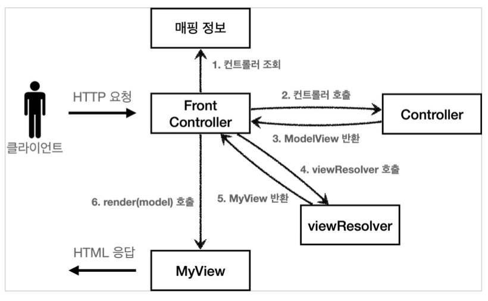
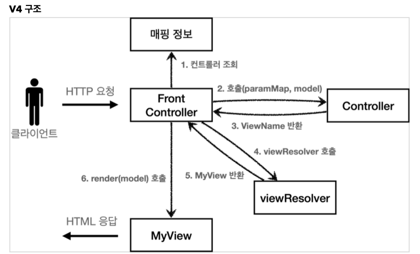

# 프론트 컨트롤러 패턴(2)

태그: 스프링 MVC

## 프론트 컨트롤러 패턴

- **Model 추가 - V3**
    - **서블릿 종속성 제거**
        - 컨트롤러 입장에서 HttpServletRequest, HttpServletResponse는 꼭 필요하지 않다
        - 요청 파라미터 정보는 Map으로 넘기도록 하면 컨트롤러가 서블릿 기술을 몰라도 동작할 수 있다
        - request 객체를 Model로 사용하는 대신에 별도의 Model 객체를 만들어 반환
    - **뷰 이름 중복 제거**
        - 컨트롤러에서 지정하는 뷰의 이름에 중복이 있다
        - 컨트롤러는 뷰의 논리 이름을 반환하고 실제 물리 위치의 이름은 프론트 컨트롤러에서 처리하도록 단순화한다
    - **V3 구조**
        
        
        
    - **ModelView**
        - 서블릿 종속성을 제거하기 위해 Model을 직접 만들고, view 이름을 전달하는 객체이다
        
        ```java
        @Getter @Setter
        public class ModelView {
        	private String viewName;
        	private Map<String, Object> model = new HashMap<>();
        	public ModelView(String viewName) {
        		this.viewName = viewName;
        	}
        }
        ```
        
        - 뷰의 이름과 뷰를 렌더링할 때 필요한 model 객체를 가진다
    - **ControllerV3**
        
        ```java
        public interface ControllerV3 {
        	ModelView process(Map<String, String> paramMap);
        }
        ```
        
        - 이 컨트롤러는 서블릿 기술을 전혀 사용하지 않는다.
            - 구현이 단순해지고, 테스트 코드 작성하기가 쉬워진다
        - HttpServletRequest가 제공하는 파라미터는 프론트 컨트롤러가 paramMap에 담아서 호출해주면 된다.
        - 컨트롤러는 응답으로 뷰 이름과 뷰에 전달할 Model 데이터를 포함하는 ModelView 객체를 반환하면 된다
    - **컨트롤러**
        
        ```java
        public class MemberFormControllerV3 implements ControllerV3 {
        	@Override
        	public ModelView process(Map<String, String> paramMap) {
        		return new ModelView("new-form");
        	}
        }
        ```
        
        - ModelView를 생성할 때 new-form이라는 뷰의 논리적인 이름을 지정한다.
            - 실제 물리적인 이름은 프론트 컨트롤러가 처리한다.
    - **프론트 컨트롤러**
        
        ```java
        @WebServlet(name = "frontControllerServletV3", urlPatterns = "/front-controller/v3/*")
        public class FrontControllerServletV3 extends HttpServlet {
            private Map<String, ControllerV3> controllerMap = new HashMap<>();
        
            public FrontControllerServletV3() {
                controllerMap.put("/front-controller/v3/members/new-form", new MemberFormControllerV3());
                controllerMap.put("/front-controller/v3/members/save", new MemberSaveControllerV3());
                controllerMap.put("/front-controller/v3/members", new MemberListControllerV3());
            }
        
            @Override
            protected void service(HttpServletRequest request, HttpServletResponse response) throws ServletException, IOException {
                String requestURI = request.getRequestURI();
                ControllerV3 controller = controllerMap.get(requestURI);
                if(controller == null) {
                    response.setStatus(HttpServletResponse.SC_NOT_FOUND);
                    return;
                }
        
                Map<String, String> paramMap = createParamMap(request);
        
                ModelView mv = controller.process(paramMap);
                String viewName = mv.getViewName();
                MyView view = viewResolver(viewName);
                view.render(mv.getModel() , request, response);
            }
        
            private MyView viewResolver(String viewName) {
                return new MyView("/WEB-INF/views/" + viewName + ".jsp");
            }
        
            private Map<String, String> createParamMap(HttpServletRequest request) {
                Map<String, String> paramMap = new HashMap<>();
                request.getParameterNames().asIterator()
                        .forEachRemaining(paramName -> paramMap.put(paramName, request.getParameter(paramName)));
                return paramMap;
            }
        }
        ```
        
        - 뷰 리졸버
            - 컨트롤러가 반환한 논리 뷰 이름을 실제 물리 뷰 경로로 변경하고 MyView 객체를 반환한다.
            - 뷰 객체를 통해 HTML 화면을 렌더링한다
        - JSP는 request.getAttribute()로 데이터를 조회하므로 모델의 데이터를 꺼내서 request 객체에 담아야한다
- **단순하고 실용적인 컨트롤러 - V4**
    - V3 버전에서 항상 ModelView를 생성하는 부분이 조금 번거롭다
    - 이 부분을 변경해서 개발자들이 편리하게 개발할 수 있도록 개선한다
    - **V4 구조**
        
        
        
        - 기본적인 구조는 V3과 같다. 대신 컨트롤러가 ModelView를 반환하지 않고 viewName을 반환한다
    - **ControllerV4**
        
        ```java
        public interface ControllerV4 {
        	String process(Map<String, String> paramMap, Map<String, Object> model);
        }
        ```
        
        - 결과로 뷰의 이름만 반환한다
    - **컨트롤러**
        
        ```java
        public class MemberFormControllerV4 implements ControllerV4 {
        	@Override
        	public String process(Map<String, String> paramMap, Map<String, Object> model) {
        		return "new-form";
        	}
        }
        ```
        
        - 단순하게 new-form이라는 논리 이름만 반환한다.
        - model.put(”member”, member)
            - 모델이 파라미터로 전달되므로 모델을 직접 생성하지 않아도 된다
    - **프론트 컨트롤러**
        - 모델 객체 전달
            
            ```java
            Map<String, Object> model = new HashMap<>(); // 프론트 컨트롤러에서 생성하여 컨트롤러로 전달
            ```
            
        - 뷰의 논리 이름을 직접 반환
            
            ```java
            String viewName = controller.process(paramMap, model);
            MyView view = viewResolver(viewName);
            ```
            
- **유연한 컨트롤러 - V5**
    - **어댑터 패턴**
        - 지금까지 개발한 프론트 컨트롤러는 한가지 방식의 컨트롤러 인터페이스만 사용할 수 있다.
        - 따라서 ControllerV3과 ControllerV4는 완전히 다른 인터페이스이다.
        - 이럴때 어댑터 패턴을 사용하여 프론트 컨트롤러가 다양한 방식의 컨트롤러를 처리할 수 있도록 변경할 수 있다.
    - **V5 구조**
        
        
        
        - 핸들러 어댑터 : 어댑터 역할을 하는 어댑터가 추가되었다. 이 어댑터 덕분에 다양한 종류의 컨트롤러를 호출할 수 있다.
        - 핸들러 : 컨트롤러의 이름을 더 넓은 범위인 핸들러로 변경한다. 이제 어댑터가 있기 때문에 꼭 컨트롤러의 개념 뿐만 아니라 어떠한 것이든 해당하는 종류의 어댑터만 있으면 다 처리할 수 있다.
    - **MyHandlerAdapter**
        
        ```java
        public interface MyHandlerAdapter {
        	boolean supports(Object handler);
        	ModelView handle(HttpServletRequest request, HttpServletResponse response, Object handler)
        		throws ServletException, IOException;
        }
        ```
        
        - support 메서드
            - 어댑터가 해당 컨트롤러를 처리할 수 있는지 판단하는 메서드이다
        - handle 메서드
            - 어댑터는 실제 컨트롤러를 호출하고 그 결과로 ModelView를 반환한다
            - 실제 컨트롤러가 ModelView를 반환하지 못한다면 어댑터가 직접 생성해서 반환한다
            - 이전에는 프론트 컨트롤러가 실제 컨트롤러를 호출했지만, 이제 이 어댑터를 통해 실제 컨트롤러가 호출된다
        - 이 인터페이스를 구현하여 각 컨트롤러를 처리할 수 있는 핸들러 어댑터를 구현한다.
    - **프론트 컨트롤러**
        - 컨트롤러 → 핸들러
            - 이전에는 컨트롤러를 직접 매핑해서 사용했다.
            - 이제는 어댑터를 사용하므로 어댑터가 지원하기만 하면 어떤 것이라도 URL에 매핑하여 사용할 수 있다.
        - 매핑 정보
            
            ```java
            private final Map<String, Object> handlerMappingMap = new HashMap<>();
            ```
            
            - 매핑 정보의 값이 ControllerV3, ControllerV4 같은 인터페이스에서 아무 값이나 받을 수 있는 Object로 변경되었다
        - 핸들러를 처리할 수 있는 어댑터 조회
            
            ```java
            MyHandlerAdapter adapter = getHandlerAdapter(handler)
            for(MyHandlerAdapter adapter : handlerAdapters) {
            	if(adapter.supports(handler)) {
            		return adapter;
            	}
            }
            ```
            
            - handler를 처리할 수 있는 어댑터를 supports 메서드를 통해 찾는다.
            - handler가 ControllerV3 인터페이스를 구현했다면 ControllerV3HandlerAdapter 객체가 반환된다
        - 어댑터 호출
            
            ```java
            ModelView mv = adapter.handle(request, response, handler);
            ```
            
            - 어댑터의 handle 메서드를 통해 실제 어댑터가 호출된다
            - 어댑터는 핸들러를 호출하고 그 결과를 어댑터에 맞춰 반환한다
    - **ControllerV4를 사용하기**
        
        ```java
        @Override
            public ModelView handle(HttpServletRequest request, HttpServletResponse response, Object handler) throws ServletException, IOException {
                ControllerV4 controller = (ControllerV4) handler;
                Map<String, String> paramMap = createParamMap(request);
                HashMap<String, Object> model = new HashMap<>();
                String viewName = controller.process(paramMap, model);
                ModelView mv = new ModelView(viewName);
                mv.setModel(model);
                return mv;
          }
        ```
        
        - handler를 ControllerV4로 캐스팅 한 뒤 paramMap과 model을 만들어 해당 컨트롤러를 호출하고 viewName을 반환받는다.
        - 여기서 ControllerV4는 뷰의 이름을 반환한다. 어댑터는 뷰의 이름이 아닌 ModelView 객체를 반환해야한다.
        - 따라서 어댑터가 ModelView를 만들어 반환한다. 이것이 어댑터가 꼭 필요한 이유이다.