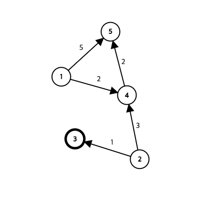

# 플로이드 워셜

## 플로이드 워셜 알고리즘

- 그래프에서 모든 노드에 대한 최단 거리를 찾는 알고리즘이다
    - 다익스트라와의 차이점
        - 다익스트라는 한 노드에 대한 최단거리를 찾지만 플로이드 워셜 알고리즘은 모든 노드에 대해 최단 거리를 찾는다.
        - 음의 간선에서도 사용할 수 있다
- **핵심 아이디어**
    - 거쳐가는 노드를 기준으로 알고리즘을 수행한다
    - 한 정점에서 바로 가는 것과 거쳐가는 것 중 최단거리를 선택
        - **DP의 아이디어를 사용한다.**
        - DP[i][j] = Min(DP[i][k] + DP[k][j], DP[i][j])
    - n개의 노드 모두를 거쳐가는 노드로 설정
    - 이후 해당 노드를 거치는 거리과 직접 가는 거리를 비교하여 더 작은 값 선택
- **초기값**
    - 초기값으로는 적당히 큰 값을 설정해야함 (Integer.MAX_VALUE 사용시 오버플로우 발생할 수 있음)
    - 자기 자신으로 가는 비용은 0임
    - 현재 노드가 포함된 열이나 행은 업데이트 하지 않는다
- **과정**
    
    
    
    |  | 1 | 2 | 3 | 4 | 5 |
    | --- | --- | --- | --- | --- | --- |
    | 1 | 0 | INF | INF | 2 | 5 |
    | 2 | INF | 0 | 1 | 3 | INF |
    | 3 | INF | INF | 0 | INF | INF |
    | 4 | INF | INF | INF | 0 | 2 |
    | 5 | INF | INF | INF | INF | 0 |
    
    초기값은 다음과 같이 설정되어있다 (거쳐가지 않고 직접 가는 경우)
    
    거쳐가는 노드를 1부터 5까지 설정하면 다음과 같다
    
    거쳐가는 노드가 4일 때를 보면
    
    |  | 1 | 2 | 3 | 4 | 5 |
    | --- | --- | --- | --- | --- | --- |
    | 1 | 0 | INF | INF | 2 | 4 |
    | 2 | INF | 0 | 1 | 3 | 5 |
    | 3 | INF | INF | 0 | INF | INF |
    | 4 | INF | INF | INF | 0 | 2 |
    | 5 | INF | INF | INF | INF | 0 |
    
    4를 거쳐가면 
    
    DP[1][5] = Min(DP[1][5], DP[1][4] + DP[4][1]) = Min(5, 4) = 4 이므로 최솟값이 갱신된다
    
    마찬가지로
    
    DP[2][5] = Min(DP[2][5], DP[2][4] + DP[4][5]) = Min(INF, 5) = 5 이므로 최솟값이 갱신된다.
    
    모든 노드에 대해 이러한 과정을 거쳐 모든 노드에 대한 최단거리를 구할 수 있다.
    
- **코드**
    
    ```java
    public class Main {
        static void floydWarshall(int[][] arr) {
            int n = arr.length;
            for(int i = 0; i < n; i++) {
                for(int j = 0; j < n; j++) {
                    for(int k = 0; k < n; k++) {
                        arr[j][k] = Math.min(arr[j][k], arr[j][i] + arr[i][k]);
                    }
                }
            }
        }
        public static void main(String[] args) throws IOException {
            BufferedReader br = new BufferedReader(new InputStreamReader(System.in));
            BufferedWriter bw = new BufferedWriter(new OutputStreamWriter(System.out));
    
            int n = Integer.parseInt(br.readLine());
            int m = Integer.parseInt(br.readLine());
            int[][] arr = new int[n][n];
            int inf = 9999999;
    
            for(int i = 0; i < n; i++) {
                for(int j = 0; j < n; j++) {
                    if(i == j) {
                        arr[i][j] = 0;
                        continue;
                    }
                    arr[i][j] = inf;
                }
            }
    
            for(int i = 0; i < m; i++) {
                StringTokenizer st = new StringTokenizer(br.readLine());
                int from = Integer.parseInt(st.nextToken());
                int to = Integer.parseInt(st.nextToken());
                int cost = Integer.parseInt(st.nextToken());
                arr[from - 1][to - 1] = Math.min(arr[from - 1][to - 1], cost);
            }
    
            floydWarshall(arr);
    
            for(int i = 0; i < n; i++) {
                for(int j = 0; j < n; j++) {
                    if(arr[i][j] == inf) bw.write(0 + " ");
                    else bw.write(arr[i][j] + " ");
                }
                bw.write("\n");
            }
            bw.flush();
            br.close();
            bw.close();
        }
    }
    ```
    
    백준 11404번을 푼