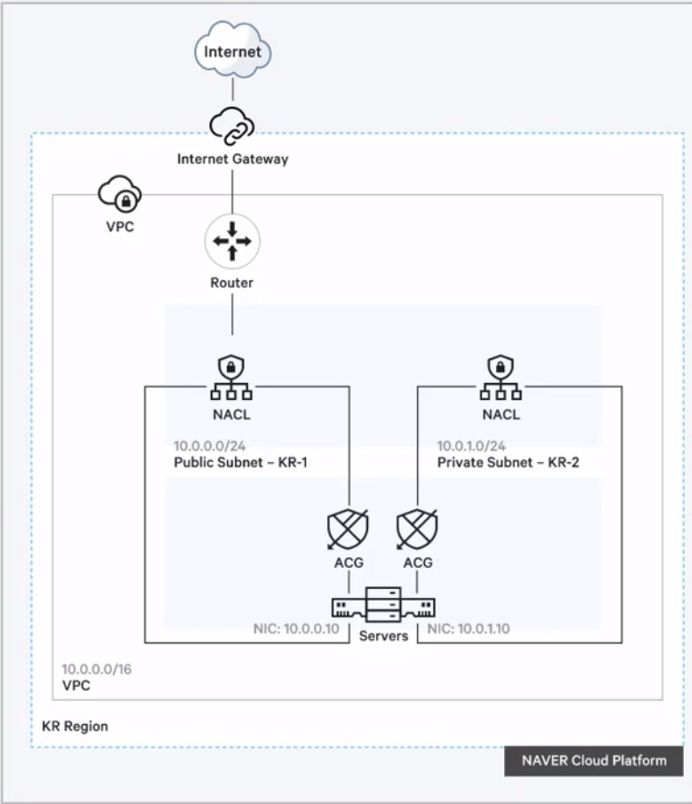

# NCP 2일차

## 

## VPC

- 클라우드상에서 논리적으로 격리된 고객 전용 네트워크 공간
    - 계정당 최대 3개의 VPC 생성 가능
- IP 주소 범위
    - 일반 사설 IP 대역과 같음
    - 최소 /28에서 최대/16까지 넷마스크 생성 가능
    - 서브넷을 이용하여 VPC 안에서 Segment 생성 관리 가능
- Peering
    - VPC간 연결을 위한 네트워크 구성
    - 내 VPC간 연결 뿐만 아니라 다른 계정과의 VPC 연결도 가능

## ACG & NACL

- NACL - 서브넷 단위
    - Network Acess Control List의 약자로 VPC의 보안을 강화시키는 요ㅗ소
    - NACL이 서브넷에 적용되어 외부에서 접속시 NACL 룰 검사가 먼저 진행
    - Allow/Deny 모두 설정 가능, 상태 비저장 방식
    - Default All Permit
    - 우선순위에 따라 규칙을 반영
- ACG - 서버 단위로 적용
    - Allow 규칙에 한하여 지원
    - 모든 규칙을 확인하여 판단
    - Default All Deny
- NACL 생성
    - VPC에 종속적인 NACL 생성가능
    - 서브넷 레벨에서 동작

## Subnet

- 서브넷 속성
    - VPC 주소 범위 내에서 CIDR 형태로 주소 범위 지정
    - Zone을 지정할 수 있으며 동일한 Zone 내에 여러 서브넷 생성 가능
    - 인터넷과 연결되는 Public Subnet과 폐쇄적인 Private Subnet으로 구분
    - Public Subnet 내에 있는 서버만 Public IP 부여 가능
    - VPC당 최대 200개의 서브넷 생성
- Public Subnet
    - 서버만 위치시킬 수 있으며 공인IP 부여
- Private Subnet
    - 서버 또는 로드 밸런서를 위치시킬 수 있음